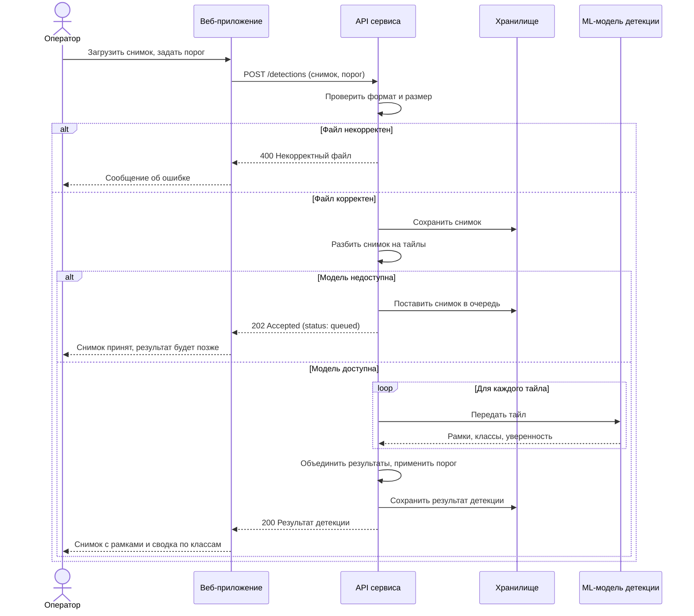
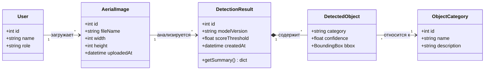

# Диаграммы

## Диаграмма последовательности

Диаграмма показывает выполнение сценария UC-01 «Детекция объектов на аэроснимке».

```mermaid
sequenceDiagram
    actor Operator as Оператор
    participant App as Веб-приложение
    participant API as API сервиса
    participant Storage as Хранилище
    participant Model as ML-модель детекции

    Operator->>App: Загрузить снимок, задать порог
    App->>API: POST /detections (снимок, порог)
    API->>API: Проверить формат и размер
    alt Файл некорректен
        API-->>App: 400 Некорректный файл
        App-->>Operator: Сообщение об ошибке
    else Файл корректен
        API->>Storage: Сохранить снимок
        API->>API: Разбить снимок на тайлы
        alt Модель недоступна
            API->>Storage: Поставить снимок в очередь
            API-->>App: 202 Accepted (status: queued)
            App-->>Operator: Снимок принят, результат будет позже
        else Модель доступна
            loop Для каждого тайла
                API->>Model: Передать тайл
                Model-->>API: Рамки, классы, уверенность
            end
            API->>API: Объединить результаты, применить порог
            API->>Storage: Сохранить результат детекции
            API-->>App: 200 Результат детекции
            App-->>Operator: Снимок с рамками и сводка по классам
        end
    end
```

## Диаграмма классов

```mermaid
classDiagram
    direction LR
    class User {
        +int id
        +string name
        +string role
    }

    class AerialImage {
        +int id
        +string fileName
        +int width
        +int height
        +datetime uploadedAt
    }

    class DetectionResult {
        +int id
        +string modelVersion
        +float scoreThreshold
        +datetime createdAt
        +getSummary() dict
    }

    class DetectedObject {
        +string category
        +float confidence
        +BoundingBox bbox
    }

    class ObjectCategory {
        +int id
        +string name
        +string description
    }

    User "1" --> "*" AerialImage : загружает
    AerialImage "1" --> "*" DetectionResult : анализируется
    DetectionResult "1" *-- "*" DetectedObject : содержит
    DetectedObject "*" --> "1" ObjectCategory : относится к
```
